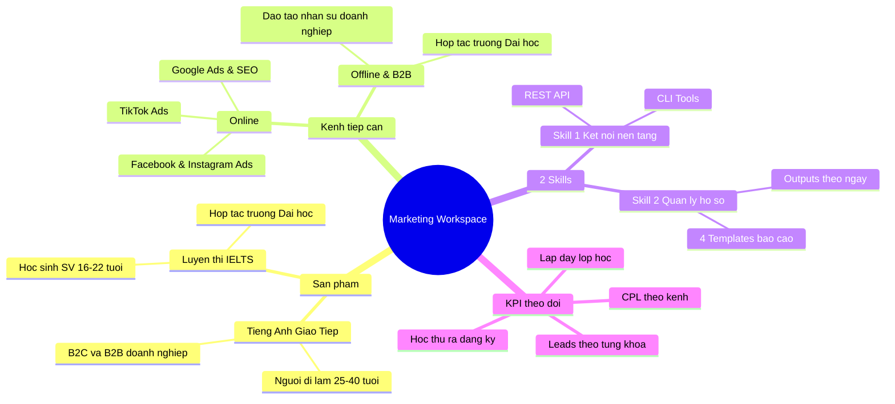
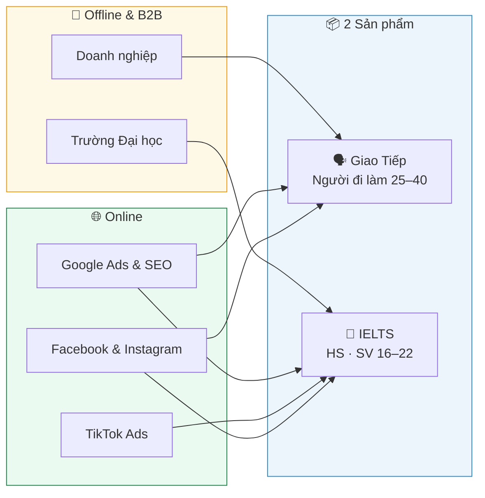
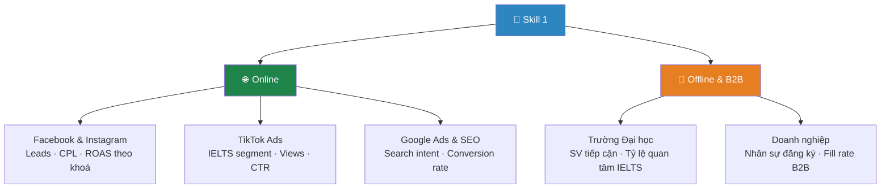
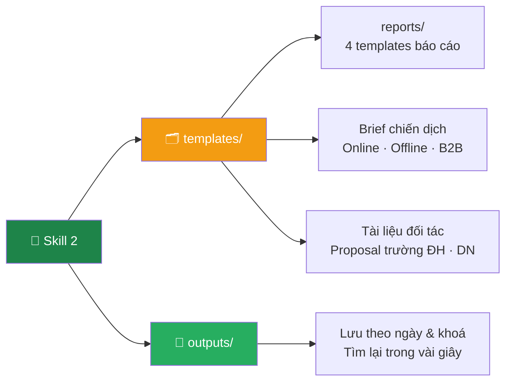
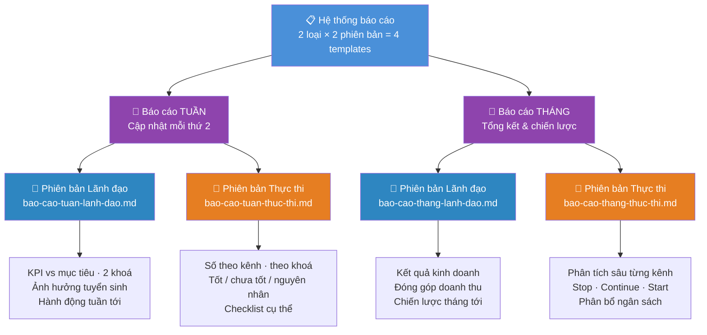
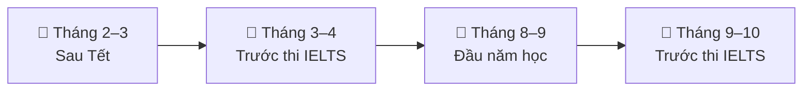
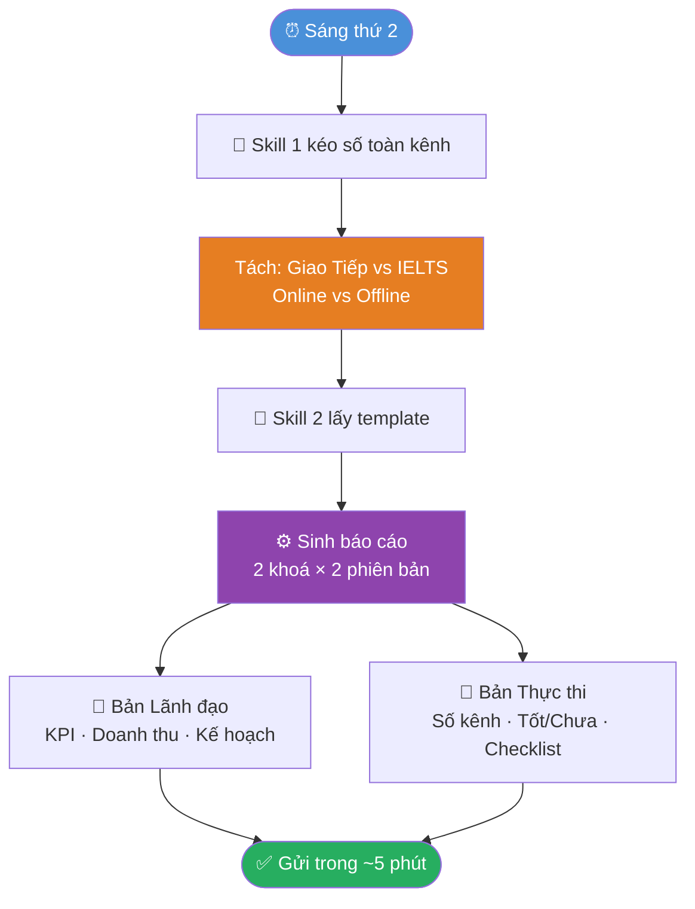
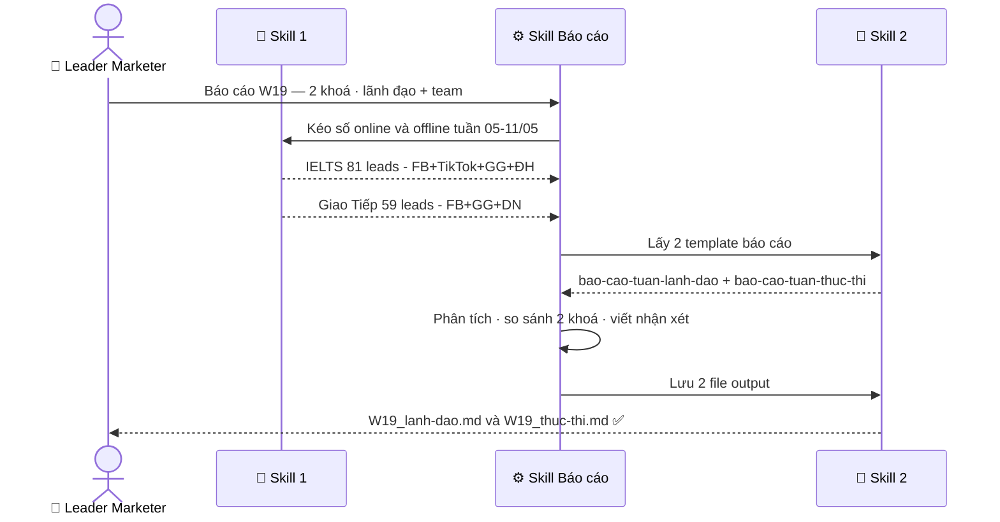
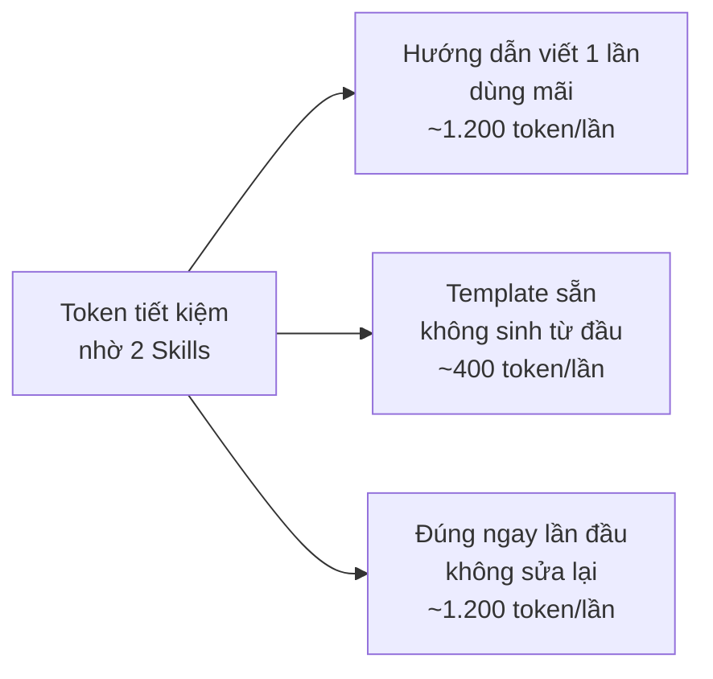

# 🎓 Marketing Workspace — Trung tâm Anh ngữ

> Workspace của **Leader Marketer** · Trung tâm Anh ngữ · Chạy trên Claude Code  
> Tối ưu cho 2 sản phẩm: **Tiếng Anh Giao Tiếp** (người đi làm) & **Luyện thi IELTS** (HS · SV)

**Xem nhanh:** [2 Skills](#-2-skills-cốt-lõi) · [Templates](#-hệ-thống-4-templates-báo-cáo) · [Workflow](#-workflow-hàng-tuần--sáng-thứ-2) · [Demo output](#-output-thực-tế) · [Dùng ngay](#-dùng-ngay)

---

## 🗺️ Toàn cảnh



---

## 📦 2 Sản phẩm · 3 Kênh tiếp cận



---

## ⚡ 2 Skills cốt lõi

| | 🔗 Skill 1 | 📁 Skill 2 |
|--|-----------|-----------|
| **Vai trò** | Người kết nối | Người quản lý hồ sơ |
| **Làm gì** | Kéo số từ tất cả kênh về 1 chỗ | Giữ template & lưu output đúng chỗ |
| **Gọi bằng** | `/ket-noi-nen-tang-ngoai` | `/quan-ly-files` |
| **Phục vụ** | Báo cáo · Phân tích · So sánh kênh | Brief · Kết quả · Tài liệu đối tác |

---

## 🔗 Skill 1 — Kết nối nền tảng



| Bạn nói | Skill làm |
|---------|----------|
| _"Leads tuần này theo từng khoá và từng kênh"_ | Kéo FB + TikTok + Google → tách IELTS vs Giao Tiếp |
| _"So sánh CPL online vs offline tháng này"_ | Tổng hợp chi phí · CPL từng nguồn · highlight bất thường |
| _"Hiệu quả hợp tác trường ĐH tháng này"_ | Tổng hợp leads offline · so sánh CPL với online |

---

## 📁 Skill 2 — Quản lý hồ sơ



---

## 📋 Hệ thống 4 Templates báo cáo



| Template | Đọc trong | Ai đọc | Nội dung chính |
|----------|----------|--------|---------------|
| `bao-cao-tuan-lanh-dao.md` | 3 phút | Ban lãnh đạo | KPI · 2 khoá · ảnh hưởng phòng ban |
| `bao-cao-tuan-thuc-thi.md` | 10 phút | Team marketing | Số theo kênh · tốt/chưa tốt · checklist |
| `bao-cao-thang-lanh-dao.md` | 5 phút | Ban lãnh đạo | Kết quả tháng · chiến lược tháng tới |
| `bao-cao-thang-thuc-thi.md` | 15 phút | Team marketing | Phân tích sâu · Stop/Continue/Start |

---

## 📅 Workflow theo mùa tuyển sinh



| Đợt | Ưu tiên khoá | Kênh đẩy mạnh | Hành động chính |
|-----|-------------|--------------|----------------|
| **Tháng 2–3** (Sau Tết) | 🗣️ Giao Tiếp | Facebook · Google | Người đi làm đặt mục tiêu năm mới |
| **Tháng 3–4** (Trước IELTS) | 📝 IELTS | TikTok · SEO · ĐH | HS-SV chuẩn bị kỳ thi quốc tế |
| **Tháng 8–9** (Đầu năm học) | Cả 2 khoá | Tất cả kênh | Tăng ngân sách · Hợp tác doanh nghiệp |
| **Tháng 9–10** (Trước IELTS) | 📝 IELTS | Retarget · Lookalike | Học viên đã đậu làm social proof |

---

## 🔄 Workflow hàng tuần — Sáng thứ 2



---

## 📊 Ví dụ thực tế — Báo cáo tuần W19

> **Số liệu thực chạy:** FB 85 · TikTok 23 · Google 20 · Offline/ĐH 12 · Tổng **140 leads**

**So sánh 2 khoá:**

| KPI | 🗣️ Giao Tiếp | 📝 IELTS | Ghi chú |
|-----|------------|--------|---------|
| Leads tuần | 59 | 81 | IELTS cao — gần mùa thi T3-4 |
| CPL trung bình | 132.000đ | 124.000đ | Cả 2 dưới ngưỡng 150k ✅ |
| Leads offline (ĐH · DN) | 8 | 4 | Giao Tiếp từ DN · IELTS từ ĐH |
| Học thử → đăng ký | 9,1% | 6,8% | Giao Tiếp convert tốt hơn |
| Lấp đầy lớp | 78% | 65% | IELTS cần đẩy thêm |



---

## 📂 Output thực tế

> Tất cả file kết quả nằm trong [`skills/quan-ly-files/outputs/`](skills/quan-ly-files/outputs/)

| File | Mô tả |
|------|-------|
| [`DEMO_bao-cao-skill-chay-thu.md`](skills/quan-ly-files/outputs/DEMO_bao-cao-skill-chay-thu.md) | Giải thích từng bước skill chạy như thế nào |
| [`2026-05-11_bao-cao-tuan-W19_lanh-dao.md`](skills/quan-ly-files/outputs/2026-05-11_bao-cao-tuan-W19_lanh-dao.md) | Báo cáo W19 — phiên bản ban lãnh đạo |
| [`2026-05-11_bao-cao-tuan-W19_thuc-thi.md`](skills/quan-ly-files/outputs/2026-05-11_bao-cao-tuan-W19_thuc-thi.md) | Báo cáo W19 — phiên bản nhóm thực thi |

---

## ⏱️ Trước & Sau khi có Skills

| Công việc | ⏰ Trước | ⚡ Sau |
|-----------|---------|-------|
| Tổng hợp số online + offline 2 khoá | 45 phút | Tự động |
| Báo cáo lãnh đạo (2 khoá) | 75 phút | 0 phút |
| Báo cáo team thực thi | 75 phút | 0 phút |
| Brief chiến dịch + proposal đối tác | 60 phút | 15 phút |
| **Tổng / tuần** | **~4.5 giờ** | **~15 phút** |

---

## 💡 Token & Lợi ích



| | Không có Skills | Có Skills | Tiết kiệm |
|--|----------------|-----------|----------|
| Giải thích 2 khoá · 3 kênh · 2 phiên bản | ~1.200 token | ~0 token | ~1.200 token |
| Sinh sai format · làm lại | ~1.200 token | ~0 token | ~1.200 token |
| Sinh đúng ngay lần đầu | — | ~800 token | — |
| **Tổng / lần báo cáo** | **~3.400 token** | **~800 token** | **~76%** |

> 📅 **8 báo cáo/tháng** (4 tuần × 2 phiên bản): ~27.200 → ~6.400 token · **Tiết kiệm ~20.800 token/tháng**

| | Lợi ích | Với trung tâm Anh ngữ |
|-|---------|----------------------|
| 🎯 | **Nhất quán** | Báo cáo 2 khoá cùng format · so sánh dễ qua các tuần |
| 📈 | **Tích luỹ** | Kho lịch sử leads theo mùa thi · benchmark năm sau |
| 🤝 | **Chia sẻ** | Proposal trường ĐH · brief agency dùng chung template |
| 🧩 | **Mở rộng** | Thêm khoá TOEIC · Business English → thêm template là xong |

---

## 🚀 Dùng ngay

```bash
# Báo cáo tuần — 2 khoá · online + offline
/bao-cao  Báo cáo W20 cho lãnh đạo.
          IELTS: FB 52 leads, TikTok 19 leads, Google 14 leads, ĐH 6 leads. CPL 124k.
          Giao Tiếp: FB 38 leads, Google 16 leads, DN 8 leads. CPL 132k.

# So sánh hiệu quả kênh
/ket-noi-nen-tang-ngoai  So sánh CPL và tỷ lệ chuyển đổi
                          online vs offline tháng 5, tách riêng IELTS và Giao Tiếp.

# Brief chiến dịch mùa thi IELTS
/quan-ly-files  Tạo brief IELTS tháng 9. Target HS-SV thi tháng 10-11.
                Kênh: Facebook + TikTok + SEO + trường ĐH. Ngân sách 50tr.

# Proposal đào tạo doanh nghiệp
/quan-ly-files  Tạo proposal Tiếng Anh Giao Tiếp cho doanh nghiệp 50-200 nhân sự.
```

---

## 📂 Cấu trúc file

```
personal-workspace/
│
├── 📋 README.md
│
├── 🧠 .claude/skills/
│   ├── ket-noi-nen-tang-ngoai.md    ← FB · TikTok · Google · Offline tracking
│   ├── quan-ly-files.md             ← Template theo khoá · kênh · mùa tuyển sinh
│   └── bao-cao.md                   ← Báo cáo × 2 khoá × 2 phiên bản
│
└── 💪 skills/
    ├── 🔗 ket-noi-nen-tang-ngoai/
    │   ├── api/     Facebook · TikTok · Google Analytics config
    │   ├── mcp/     Google Sheets — tracking offline leads
    │   └── cli/     gh · export data tools
    │
    └── 📁 quan-ly-files/
        ├── templates/
        │   ├── document-template.md
        │   ├── report-template.md
        │   ├── api-spec-template.md
        │   └── reports/
        │       ├── bao-cao-tuan-lanh-dao.md      ← KPI · 2 khoá · online+offline
        │       ├── bao-cao-tuan-thuc-thi.md      ← Phân tích kênh · checklist
        │       ├── bao-cao-thang-lanh-dao.md     ← Chiến lược · mùa tuyển sinh
        │       └── bao-cao-thang-thuc-thi.md     ← Stop · Continue · Start
        └── outputs/
            ├── DEMO_bao-cao-skill-chay-thu.md
            ├── 2026-05-11_bao-cao-tuan-W19_lanh-dao.md
            └── 2026-05-11_bao-cao-tuan-W19_thuc-thi.md
```

---

<div align="center">

**🗣️ Tiếng Anh Giao Tiếp · 📝 Luyện thi IELTS**  
**🌐 Online · 🤝 Offline · 🏢 B2B Doanh nghiệp**

*Skill 1 kéo số từ mọi kênh · Skill 2 giữ template & lưu kết quả · Bạn chỉ cần ra quyết định*

</div>
