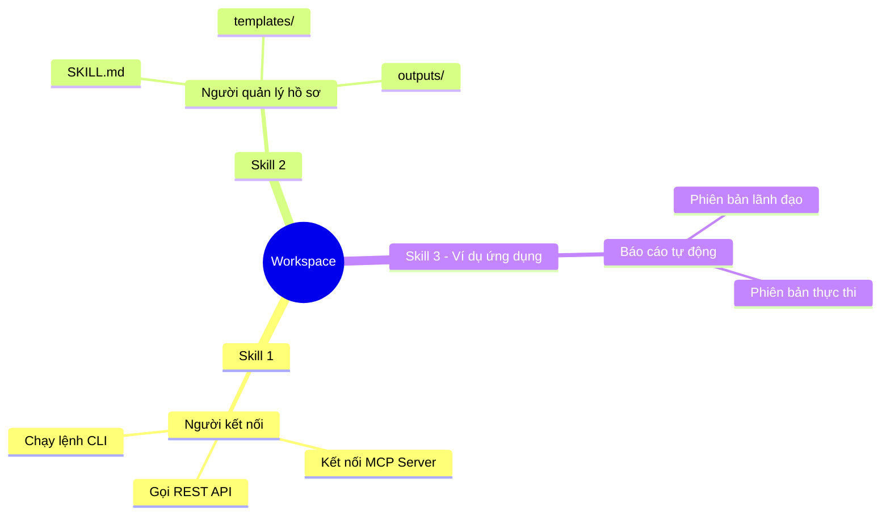
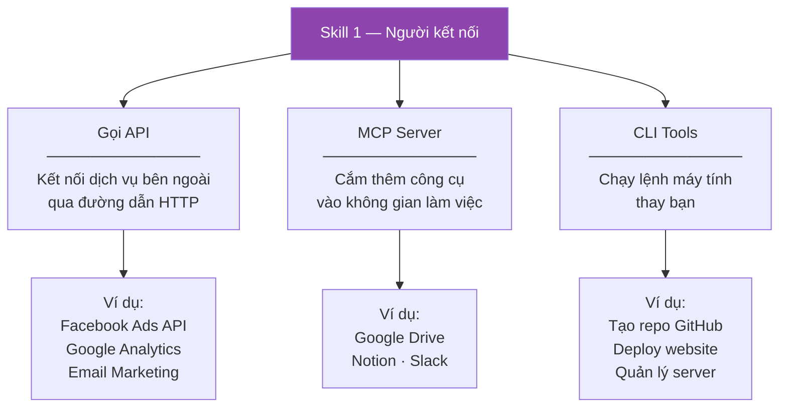
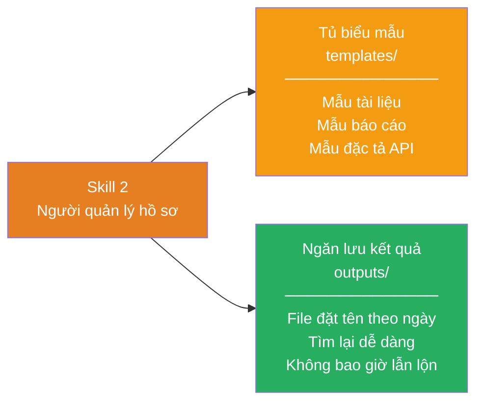
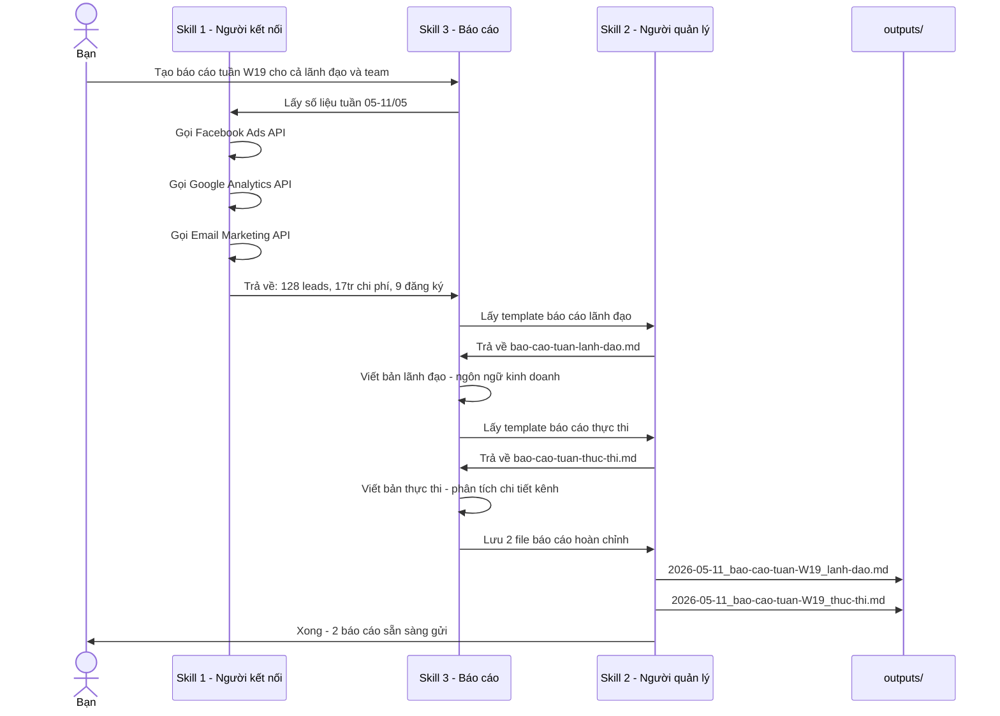

# Không gian làm việc cá nhân với các Skills

> Workspace cá nhân chạy trên **Claude Code** — xây với 2 skills cốt lõi giúp tự động hoá công việc lặp lại mà không cần biết lập trình.

---

## Workspace này có gì?



---

## Đọc theo cách của bạn

| Bạn là ai | Đọc phần nào |
|-----------|-------------|
| Non-tech — muốn hiểu skill làm gì | Phần I + II + III |
| Tech — muốn hiểu cấu trúc file và cách xây | Phần I + IV + V |
| Cả hai | Đọc từ đầu đến cuối |

---

# Phần I — Bức tranh toàn cảnh

## 2 skills hoạt động như 2 trợ lý chuyên môn


---

# Phần II — Skill 1: Người kết nối

## Skill này sinh ra để làm gì?

Mỗi khi bạn cần thông tin từ một dịch vụ bên ngoài — con số từ Facebook Ads, dữ liệu từ Google Analytics, hay muốn thực hiện một hành động trên GitHub — bạn thường phải tự mở tool đó, tìm đúng mục, kéo số về. Skill 1 làm hết việc đó thay bạn.

## 3 khả năng của Skill 1



## Ngôn ngữ đời thường

| Bạn nói | Skill 1 làm |
|---------|------------|
| "Lấy số liệu Facebook Ads tuần này" | Tự kết nối Ads API, kéo về leads, CPL, chi phí |
| "Kiểm tra traffic website hôm nay" | Tự gọi Google Analytics, trả kết quả về |
| "Tạo repo GitHub mới tên ABC" | Tự chạy lệnh `gh repo create ABC` |

---

# Phần III — Skill 2: Người quản lý hồ sơ

## Skill này sinh ra để làm gì?

Khi Skill 1 lấy dữ liệu về — hoặc khi bạn cần tạo một tài liệu mới — cần có nơi lưu đúng chỗ, đúng định dạng, đúng tên file. Skill 2 quản lý toàn bộ việc đó: cung cấp biểu mẫu sẵn có và cất kết quả ngăn nắp sau mỗi lần làm việc.

## 2 nhiệm vụ của Skill 2



## Ngôn ngữ đời thường

| Bạn nói | Skill 2 làm |
|---------|------------|
| "Tạo báo cáo tuần cho lãnh đạo" | Lấy đúng mẫu, cấu trúc sẵn, chỉ cần điền số |
| *(Sau khi xong việc)* | Tự đặt tên `2026-05-11_bao-cao-W19_lanh-dao.md`, lưu vào `outputs/` |
| "Tìm lại báo cáo tháng 3" | Tìm trong `outputs/` theo ngày, ra ngay |

---

# Phần IV — Cấu trúc file thực tế

> *Phần này dành cho người muốn hiểu bên trong mỗi skill trông như thế nào*

## Toàn bộ workspace nhìn từ cây thư mục

```
personal-workspace/
│
├── .claude/
│   └── skills/                          ← Não của từng skill
│       ├── ket-noi-nen-tang-ngoai.md    ← Skill 1: sổ tay hướng dẫn
│       ├── quan-ly-files.md             ← Skill 2: sổ tay hướng dẫn
│       └── bao-cao.md                   ← Skill ứng dụng (ví dụ)
│
└── skills/                              ← Tay chân của từng skill
    │
    ├── ket-noi-nen-tang-ngoai/          ← Files hỗ trợ Skill 1
    │   ├── api/
    │   │   ├── config.json              ← Danh sách API đã cấu hình
    │   │   └── request-template.json   ← Mẫu gọi API mới
    │   ├── mcp/
    │   │   └── config.json              ← Danh sách MCP server
    │   └── cli/
    │       └── common-commands.md       ← Bộ lệnh CLI phổ biến
    │
    └── quan-ly-files/                   ← Files hỗ trợ Skill 2
        ├── templates/                   ← Biểu mẫu tái sử dụng
        │   ├── document-template.md
        │   ├── report-template.md
        │   ├── api-spec-template.md
        │   └── reports/                 ← Mẫu báo cáo chuyên biệt
        │       ├── bao-cao-tuan-lanh-dao.md
        │       ├── bao-cao-tuan-thuc-thi.md
        │       ├── bao-cao-thang-lanh-dao.md
        │       └── bao-cao-thang-thuc-thi.md
        └── outputs/                     ← Kết quả từ các lần chạy
            └── YYYY-MM-DD_ten-file.md
```

## Bên trong một file SKILL.md trông như thế nào?

Mỗi skill là một file `.md` với 2 phần:

```
┌─────────────────────────────────┐
│  ---                            │
│  name: ten-skill                │  ← Tên để gọi skill
│  description: Mô tả ngắn       │  ← Claude dùng để biết khi nào dùng skill này
│  ---                            │
│                                 │
│  # Skill: [Tên]                 │
│                                 │
│  ## Khi nào dùng                │  ← Tình huống kích hoạt
│  ## Quy trình thực hiện        │  ← Từng bước Claude sẽ làm
│  ## Lưu ý quan trọng           │  ← Ràng buộc và ngoại lệ
└─────────────────────────────────┘
```

> **Hiểu đơn giản:** SKILL.md là bản mô tả công việc của trợ lý — viết càng rõ, trợ lý làm càng chính xác.

---

# Phần V — Ví dụ thực tế: 3 skills phối hợp tạo báo cáo

## Quy trình tạo báo cáo tuần (demo W19 — 11/05/2026)



## Kết quả: Trước và sau khi có skills

| | Trước | Sau |
|--|-------|-----|
| Kéo số từ 4 tool | 45 phút | Tự động |
| Viết báo cáo lãnh đạo | 60 phút | 0 phút |
| Viết báo cáo thực thi | 60 phút | 0 phút |
| Lưu đúng chỗ, đúng tên | 5 phút | Tự động |
| **Tổng mỗi thứ 2** | **~2.5 giờ** | **~5 phút nhập lệnh** |

---

## Xem output thực tế của lần chạy demo

Tất cả file kết quả nằm trong [`skills/quan-ly-files/outputs/`](skills/quan-ly-files/outputs/)

| File | Nội dung |
|------|---------|
| [`DEMO_bao-cao-skill-chay-thu.md`](skills/quan-ly-files/outputs/DEMO_bao-cao-skill-chay-thu.md) | Giải thích quá trình skill chạy từng bước |
| [`2026-05-11_bao-cao-tuan-W19_lanh-dao.md`](skills/quan-ly-files/outputs/2026-05-11_bao-cao-tuan-W19_lanh-dao.md) | Báo cáo tuần W19 — phiên bản ban lãnh đạo |
| [`2026-05-11_bao-cao-tuan-W19_thuc-thi.md`](skills/quan-ly-files/outputs/2026-05-11_bao-cao-tuan-W19_thuc-thi.md) | Báo cáo tuần W19 — phiên bản nhóm thực thi |

---

> **Tóm lại:** Skill 1 đi ra ngoài lấy dữ liệu — Skill 2 cung cấp khuôn mẫu và lưu kết quả — Skills ứng dụng dùng cả hai để hoàn thành công việc cụ thể.  
> Bạn chỉ cần nói lệnh, không cần tự làm bước nào.
