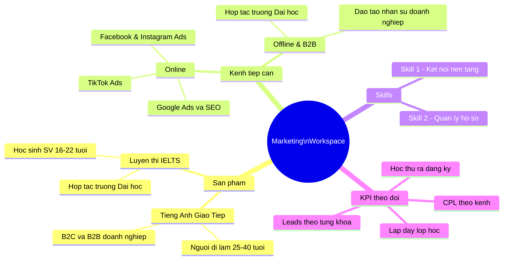
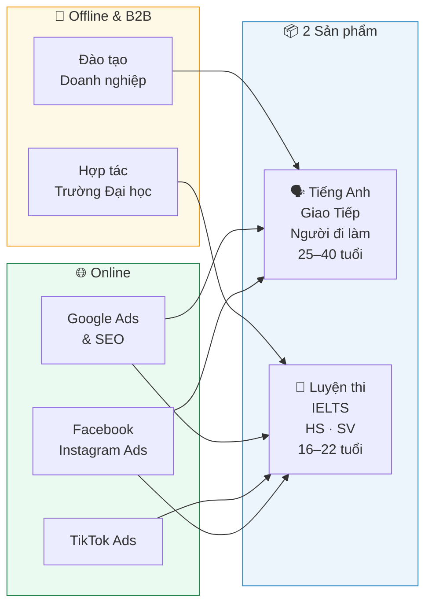
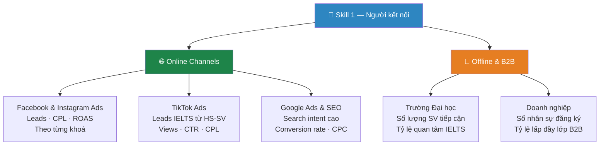
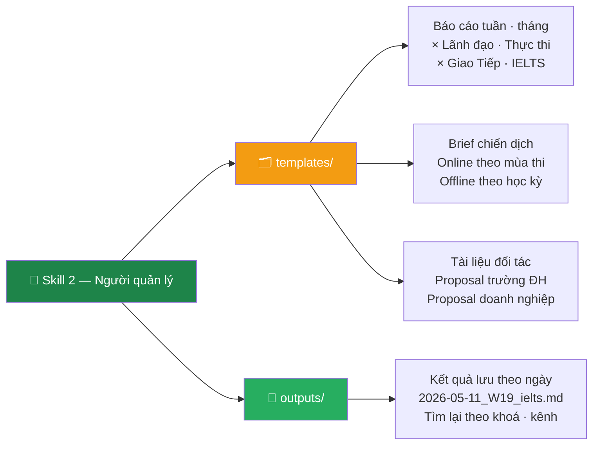
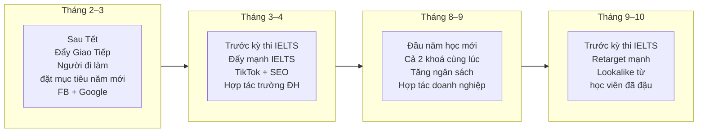
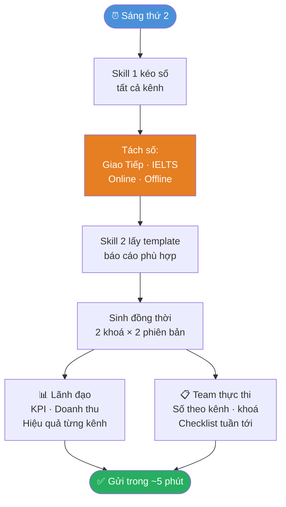
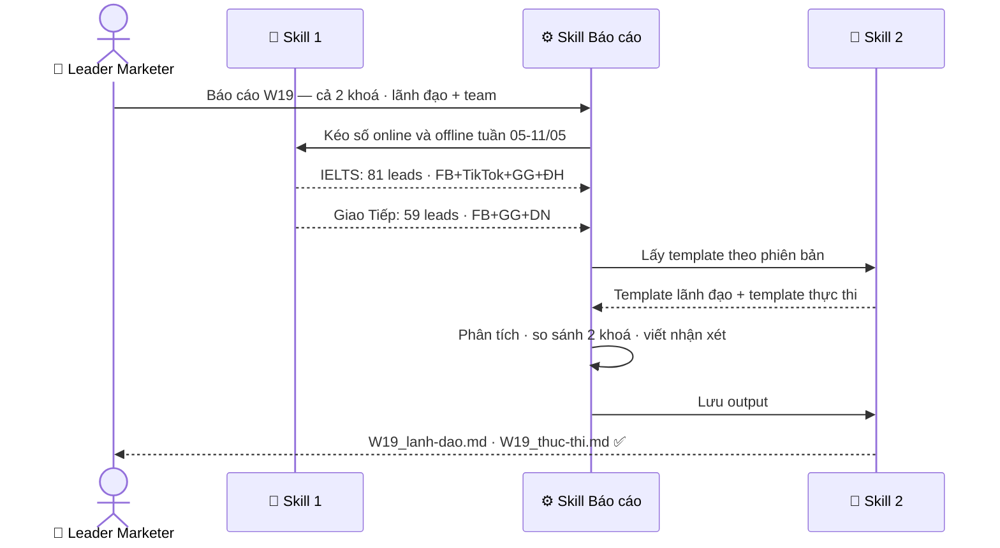

# 🎓 Marketing Workspace — Trung tâm Anh ngữ

> Workspace của **Leader Marketer** · Trung tâm Anh ngữ · Chạy trên Claude Code  
> Tối ưu cho 2 sản phẩm chính & 3 kênh tiếp cận: **Online · Offline · B2B**

---

## 🗺️ Toàn cảnh



---

## 📦 2 Sản phẩm · 3 Kênh tiếp cận



---

## ⚡ 2 Skills cốt lõi

| | 🔗 Skill 1 | 📁 Skill 2 |
|--|-----------|-----------|
| **Vai trò** | Người kết nối | Người quản lý hồ sơ |
| **Làm gì** | Kéo số từ tất cả kênh về 1 chỗ | Giữ template & lưu output đúng chỗ |
| **Gọi bằng** | `/ket-noi-nen-tang-ngoai` | `/quan-ly-files` |
| **Phục vụ** | Báo cáo · Phân tích · So sánh kênh | Brief · Kết quả · Tài liệu đối tác |

---

## 🔗 Skill 1 — Kết nối nền tảng



**Ví dụ dùng Skill 1:**

| Bạn nói | Skill làm |
|---------|----------|
| _"Leads tuần này theo từng khoá và từng kênh"_ | Kéo FB + TikTok + Google → tách IELTS vs Giao Tiếp |
| _"So sánh CPL online vs offline tháng này"_ | Tổng hợp chi phí · tính CPL từng nguồn · highlight bất thường |
| _"Khoá nào đang lấp đầy lớp nhanh hơn?"_ | Kéo số đăng ký vs chỉ tiêu lớp · so sánh 2 khoá |
| _"Hiệu quả đợt hợp tác với trường ĐH tháng này"_ | Tổng hợp leads offline · so sánh với CPL online |

---

## 📁 Skill 2 — Quản lý hồ sơ



---

## 📅 Workflow theo mùa tuyển sinh



---

## 🔄 Workflow hàng tuần — Sáng thứ 2



---

## 📊 Ví dụ thực tế — Báo cáo tuần W19

> **Số liệu:** FB 85 leads · TikTok 23 leads · Google 20 leads · Offline/ĐH 12 leads · Tổng 140 leads

**KPI so sánh 2 khoá:**

| KPI | 🗣️ Giao Tiếp | 📝 IELTS | Ghi chú |
|-----|------------|--------|---------|
| Leads tuần | 59 | 81 | IELTS cao hơn — gần mùa thi T3-4 |
| CPL trung bình | 132.000đ | 124.000đ | Cả 2 dưới ngưỡng 150k ✅ |
| Leads offline (ĐH·DN) | 8 | 4 | Giao Tiếp từ DN · IELTS từ ĐH |
| Tỷ lệ học thử → đăng ký | 9,1% | 6,8% | Giao Tiếp convert tốt hơn |
| Tỷ lệ lấp đầy lớp | 78% | 65% | IELTS cần đẩy thêm |



---

## ⏱️ Trước & Sau khi có Skills

| Công việc | ⏰ Trước | ⚡ Sau |
|-----------|---------|-------|
| Tổng hợp số online + offline 2 khoá | 45 phút | Tự động |
| Báo cáo lãnh đạo (2 khoá · online + offline) | 75 phút | 0 phút |
| Báo cáo team thực thi | 75 phút | 0 phút |
| Brief chiến dịch + proposal đối tác | 60 phút | 15 phút |
| **Tổng / tuần** | **~4.5 giờ** | **~15 phút** |

---

## 💡 Token & Lợi ích

| | Không có Skills | Có Skills | Tiết kiệm |
|--|----------------|-----------|----------|
| Giải thích 2 khoá · 3 kênh · 2 phiên bản | ~1.200 token | ~0 token | ~1.200 token |
| Sinh báo cáo sai format · làm lại | ~1.200 token | ~0 token | ~1.200 token |
| Sinh đúng ngay lần đầu | — | ~800 token | — |
| **Tổng / lần báo cáo** | **~3.400 token** | **~800 token** | **~76%** |

> 📅 **8 báo cáo/tháng** (4 tuần × 2 phiên bản): ~27.200 token → ~6.400 token  
> **Tiết kiệm ~20.800 token/tháng**

**Lợi ích khác:**

| | Lợi ích | Với trung tâm Anh ngữ |
|-|---------|----------------------|
| 🎯 | **Nhất quán** | Báo cáo 2 khoá luôn cùng format · dễ so sánh qua các tuần |
| 📈 | **Tích luỹ** | Kho lịch sử leads theo mùa thi · benchmark cho năm sau |
| 🤝 | **Chia sẻ** | Proposal trường ĐH · brief agency clone từ template sẵn |
| 🧩 | **Mở rộng** | Thêm khoá mới (TOEIC, Business English) → thêm template là xong |

---

## 🚀 Dùng ngay

```bash
# Báo cáo tuần — cả 2 khoá, cả online lẫn offline
/bao-cao  Báo cáo W20 cho lãnh đạo.
          IELTS: FB 52 leads, TikTok 19 leads, Google 14 leads, ĐH 6 leads. CPL 124k.
          Giao Tiếp: FB 38 leads, Google 16 leads, DN 8 leads. CPL 132k.

# So sánh hiệu quả kênh online vs offline
/ket-noi-nen-tang-ngoai  So sánh CPL và tỷ lệ chuyển đổi
                          online vs offline tháng 5.
                          Tách riêng IELTS và Giao Tiếp.

# Brief chiến dịch mùa thi IELTS tháng 9-10
/quan-ly-files  Tạo brief chiến dịch IELTS tháng 9.
                Target: HS-SV chuẩn bị kỳ thi tháng 10-11.
                Kênh: Facebook + TikTok + SEO + hợp tác trường ĐH.
                Ngân sách: 50tr.

# Tạo proposal hợp tác đào tạo doanh nghiệp
/quan-ly-files  Tạo proposal đào tạo Tiếng Anh Giao Tiếp
                cho doanh nghiệp 50-200 nhân sự.
```

---

## 📂 Cấu trúc file

```
personal-workspace/
│
├── 📋 README.md
│
├── 🧠 .claude/skills/
│   ├── ket-noi-nen-tang-ngoai.md    ← FB · TikTok · Google · Offline tracking
│   ├── quan-ly-files.md             ← Template theo khoá · kênh · mùa tuyển sinh
│   └── bao-cao.md                   ← Báo cáo × 2 khoá × 2 phiên bản
│
└── 💪 skills/
    ├── 🔗 ket-noi-nen-tang-ngoai/
    │   ├── api/     Facebook · TikTok · Google Analytics config
    │   ├── mcp/     Google Sheets (tracking offline leads)
    │   └── cli/     gh · export data tools
    │
    └── 📁 quan-ly-files/
        ├── templates/
        │   └── reports/
        │       ├── bao-cao-tuan-lanh-dao.md      ← KPI · 2 khoá · online+offline
        │       ├── bao-cao-tuan-thuc-thi.md      ← Phân tích kênh · checklist
        │       ├── bao-cao-thang-lanh-dao.md     ← Chiến lược · mùa tuyển sinh
        │       └── bao-cao-thang-thuc-thi.md     ← Stop · Continue · Start
        └── outputs/
            ├── 2026-05-11_bao-cao-tuan-W19_lanh-dao.md
            ├── 2026-05-11_bao-cao-tuan-W19_thuc-thi.md
            └── DEMO_bao-cao-skill-chay-thu.md
```

---

<div align="center">

**🗣️ Tiếng Anh Giao Tiếp · 📝 Luyện thi IELTS**  
**🌐 Online · 🤝 Offline · 🏢 B2B Doanh nghiệp**

*Skill 1 kéo số từ mọi kênh về · Skill 2 lưu đúng chỗ · Bạn chỉ cần ra quyết định*

</div>
