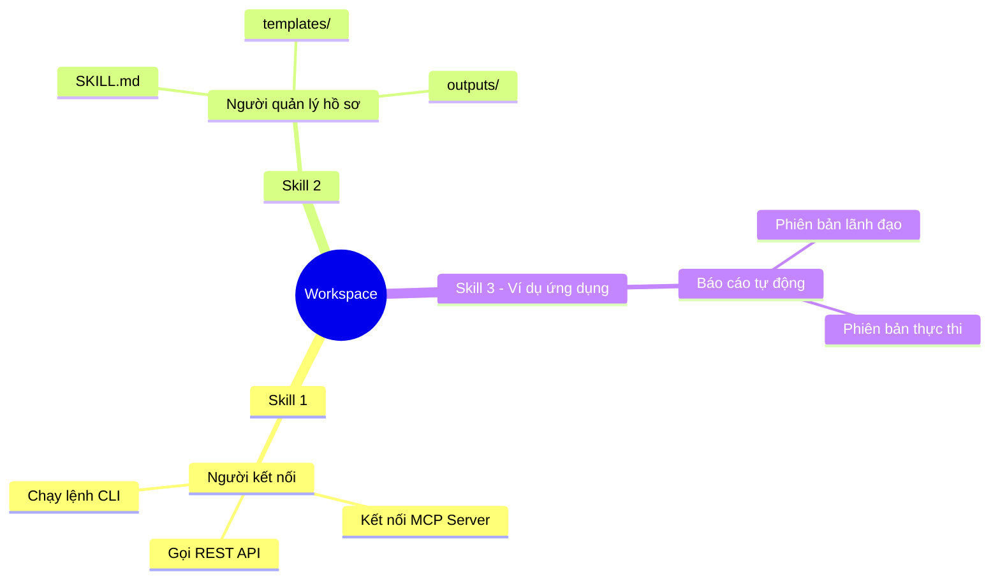
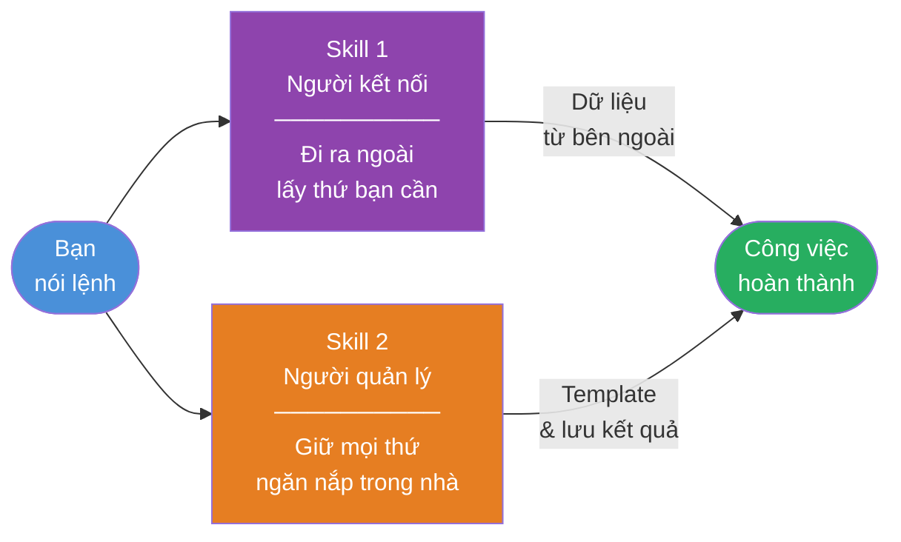
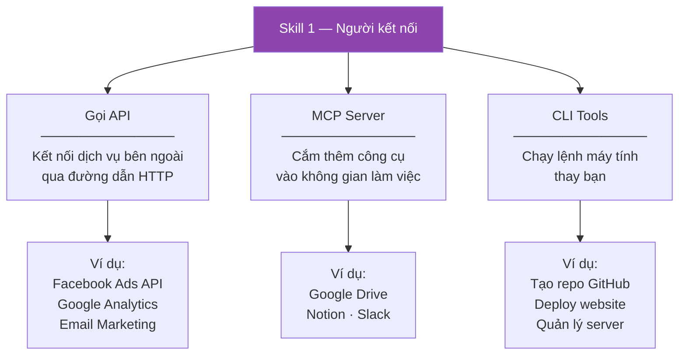
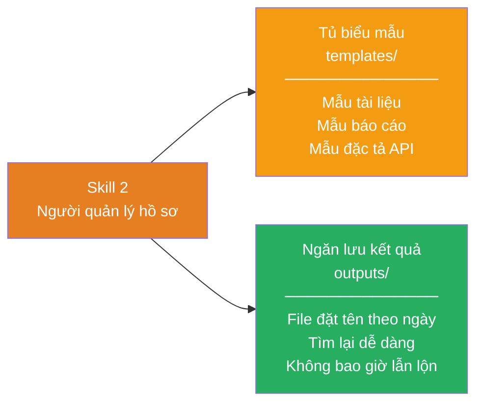
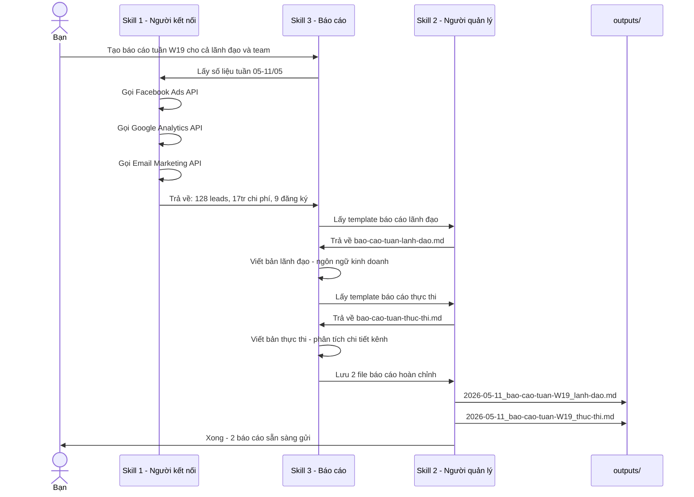
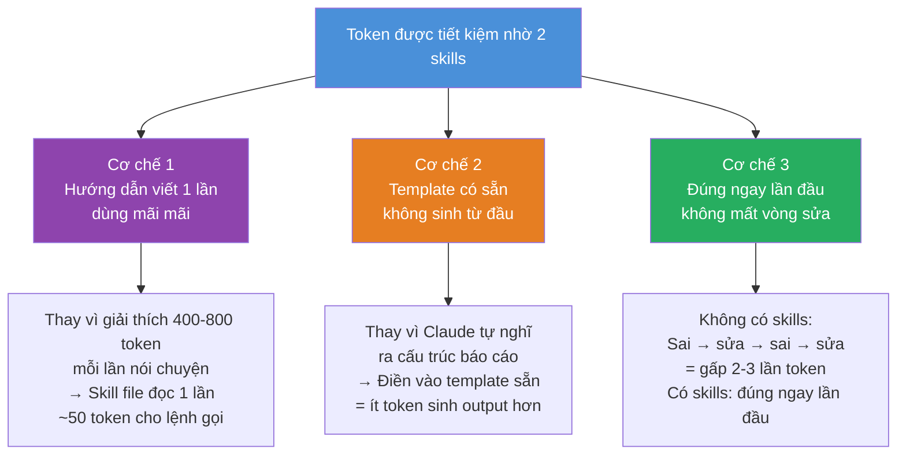
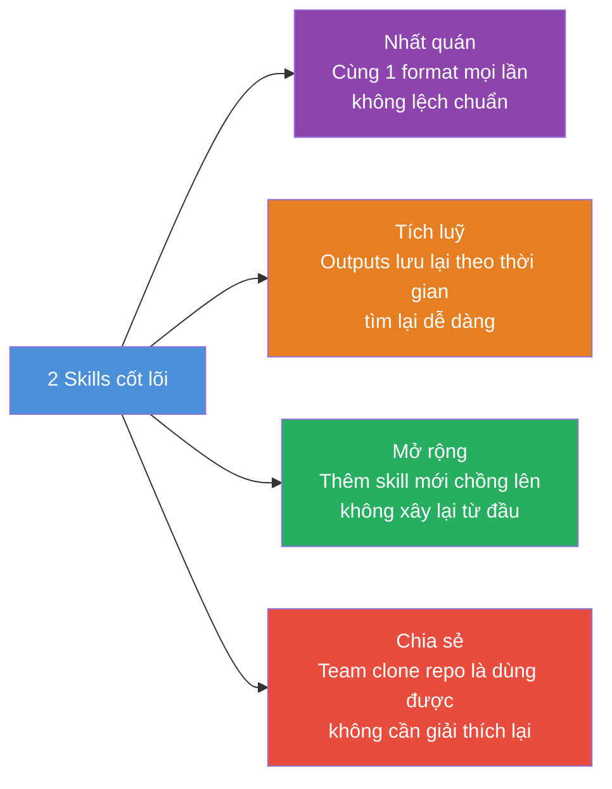

# Không gian làm việc cá nhân với các Skills

> Workspace cá nhân chạy trên **Claude Code** — xây với 2 skills cốt lõi giúp tự động hoá công việc lặp lại mà không cần biết lập trình.

---

## Workspace này có gì?



---

## Đọc theo cách của bạn

| Bạn là ai | Đọc phần nào |
|-----------|-------------|
| Non-tech — muốn hiểu skill làm gì | Phần I + II + III |
| Tech — muốn hiểu cấu trúc file và cách xây | Phần I + IV + V |
| Cả hai | Đọc từ đầu đến cuối |

---

# Phần I — Bức tranh toàn cảnh

## 2 skills hoạt động như 2 trợ lý chuyên môn



---

# Phần II — Skill 1: Người kết nối

## Skill này sinh ra để làm gì?

Mỗi khi bạn cần thông tin từ một dịch vụ bên ngoài — con số từ Facebook Ads, dữ liệu từ Google Analytics, hay muốn thực hiện một hành động trên GitHub — bạn thường phải tự mở tool đó, tìm đúng mục, kéo số về. Skill 1 làm hết việc đó thay bạn.

## 3 khả năng của Skill 1



## Ngôn ngữ đời thường

| Bạn nói | Skill 1 làm |
|---------|------------|
| "Lấy số liệu Facebook Ads tuần này" | Tự kết nối Ads API, kéo về leads, CPL, chi phí |
| "Kiểm tra traffic website hôm nay" | Tự gọi Google Analytics, trả kết quả về |
| "Tạo repo GitHub mới tên ABC" | Tự chạy lệnh `gh repo create ABC` |

---

# Phần III — Skill 2: Người quản lý hồ sơ

## Skill này sinh ra để làm gì?

Khi Skill 1 lấy dữ liệu về — hoặc khi bạn cần tạo một tài liệu mới — cần có nơi lưu đúng chỗ, đúng định dạng, đúng tên file. Skill 2 quản lý toàn bộ việc đó: cung cấp biểu mẫu sẵn có và cất kết quả ngăn nắp sau mỗi lần làm việc.

## 2 nhiệm vụ của Skill 2



## Ngôn ngữ đời thường

| Bạn nói | Skill 2 làm |
|---------|------------|
| "Tạo báo cáo tuần cho lãnh đạo" | Lấy đúng mẫu, cấu trúc sẵn, chỉ cần điền số |
| *(Sau khi xong việc)* | Tự đặt tên `2026-05-11_bao-cao-W19_lanh-dao.md`, lưu vào `outputs/` |
| "Tìm lại báo cáo tháng 3" | Tìm trong `outputs/` theo ngày, ra ngay |

---

# Phần IV — Cấu trúc file thực tế

> *Phần này dành cho người muốn hiểu bên trong mỗi skill trông như thế nào*

## Toàn bộ workspace nhìn từ cây thư mục

```
personal-workspace/
│
├── .claude/
│   └── skills/                          ← Não của từng skill
│       ├── ket-noi-nen-tang-ngoai.md    ← Skill 1: sổ tay hướng dẫn
│       ├── quan-ly-files.md             ← Skill 2: sổ tay hướng dẫn
│       └── bao-cao.md                   ← Skill ứng dụng (ví dụ)
│
└── skills/                              ← Tay chân của từng skill
    │
    ├── ket-noi-nen-tang-ngoai/          ← Files hỗ trợ Skill 1
    │   ├── api/
    │   │   ├── config.json              ← Danh sách API đã cấu hình
    │   │   └── request-template.json   ← Mẫu gọi API mới
    │   ├── mcp/
    │   │   └── config.json              ← Danh sách MCP server
    │   └── cli/
    │       └── common-commands.md       ← Bộ lệnh CLI phổ biến
    │
    └── quan-ly-files/                   ← Files hỗ trợ Skill 2
        ├── templates/                   ← Biểu mẫu tái sử dụng
        │   ├── document-template.md
        │   ├── report-template.md
        │   ├── api-spec-template.md
        │   └── reports/                 ← Mẫu báo cáo chuyên biệt
        │       ├── bao-cao-tuan-lanh-dao.md
        │       ├── bao-cao-tuan-thuc-thi.md
        │       ├── bao-cao-thang-lanh-dao.md
        │       └── bao-cao-thang-thuc-thi.md
        └── outputs/                     ← Kết quả từ các lần chạy
            └── YYYY-MM-DD_ten-file.md
```

## Bên trong một file SKILL.md trông như thế nào?

Mỗi skill là một file `.md` với 2 phần:

```
┌─────────────────────────────────┐
│  ---                            │
│  name: ten-skill                │  ← Tên để gọi skill
│  description: Mô tả ngắn       │  ← Claude dùng để biết khi nào dùng skill này
│  ---                            │
│                                 │
│  # Skill: [Tên]                 │
│                                 │
│  ## Khi nào dùng                │  ← Tình huống kích hoạt
│  ## Quy trình thực hiện        │  ← Từng bước Claude sẽ làm
│  ## Lưu ý quan trọng           │  ← Ràng buộc và ngoại lệ
└─────────────────────────────────┘
```

> **Hiểu đơn giản:** SKILL.md là bản mô tả công việc của trợ lý — viết càng rõ, trợ lý làm càng chính xác.

---

# Phần V — Ví dụ thực tế: 3 skills phối hợp tạo báo cáo

## Quy trình tạo báo cáo tuần (demo W19 — 11/05/2026)



## Kết quả: Trước và sau khi có skills

| | Trước | Sau |
|--|-------|-----|
| Kéo số từ 4 tool | 45 phút | Tự động |
| Viết báo cáo lãnh đạo | 60 phút | 0 phút |
| Viết báo cáo thực thi | 60 phút | 0 phút |
| Lưu đúng chỗ, đúng tên | 5 phút | Tự động |
| **Tổng mỗi thứ 2** | **~2.5 giờ** | **~5 phút nhập lệnh** |

---

## Xem output thực tế của lần chạy demo

Tất cả file kết quả nằm trong [`skills/quan-ly-files/outputs/`](skills/quan-ly-files/outputs/)

| File | Nội dung |
|------|---------|
| [`DEMO_bao-cao-skill-chay-thu.md`](skills/quan-ly-files/outputs/DEMO_bao-cao-skill-chay-thu.md) | Giải thích quá trình skill chạy từng bước |
| [`2026-05-11_bao-cao-tuan-W19_lanh-dao.md`](skills/quan-ly-files/outputs/2026-05-11_bao-cao-tuan-W19_lanh-dao.md) | Báo cáo tuần W19 — phiên bản ban lãnh đạo |
| [`2026-05-11_bao-cao-tuan-W19_thuc-thi.md`](skills/quan-ly-files/outputs/2026-05-11_bao-cao-tuan-W19_thuc-thi.md) | Báo cáo tuần W19 — phiên bản nhóm thực thi |

---

> **Tóm lại:** Skill 1 đi ra ngoài lấy dữ liệu — Skill 2 cung cấp khuôn mẫu và lưu kết quả — Skills ứng dụng dùng cả hai để hoàn thành công việc cụ thể.  
> Bạn chỉ cần nói lệnh, không cần tự làm bước nào.

---

# Phần VI — Tiết kiệm Token & Lợi ích thực tế

## Token là gì — và tại sao cần tiết kiệm?

> **Token** = "nhiên liệu" để Claude hoạt động. Mỗi từ bạn gõ vào và mỗi từ Claude trả lời đều tốn token. Gói sử dụng có giới hạn token mỗi tháng — dùng hết thì hết quota.

```
Không có skills:                     Có skills:
────────────────────                 ────────────────────
Mỗi cuộc hội thoại bạn phải         Skills đã lưu sẵn hướng dẫn
giải thích lại từ đầu:               Claude đọc 1 lần, hiểu ngay
  "Báo cáo theo format này,          Không cần giải thích lại
   lưu ở đây, viết giọng thế này"    Không tốn token hướng dẫn
  = Tốn 400-800 token mỗi lần       = Gần như 0 token hướng dẫn
```

---

## 3 cơ chế tiết kiệm token



---

## Ước tính tiết kiệm token — ví dụ tạo báo cáo tuần

| Bước | Không có skills | Có skills | Tiết kiệm |
|------|----------------|-----------|----------|
| Giải thích format báo cáo | ~600 token | ~0 token | ~600 token |
| Giải thích cách lưu file | ~200 token | ~0 token | ~200 token |
| Claude sinh báo cáo sai format, phải làm lại | ~1.000 token | — | ~1.000 token |
| Bạn sửa + Claude sinh lại lần 2 | ~1.200 token | — | ~1.200 token |
| Claude sinh đúng ngay lần đầu | — | ~800 token | — |
| **Tổng 1 lần báo cáo** | **~3.000 token** | **~800 token** | **~73%** |

> **4 báo cáo tuần trong 1 tháng:**  
> Không có skills: ~12.000 token | Có skills: ~3.200 token  
> **Tiết kiệm ~8.800 token/tháng — chỉ riêng việc báo cáo**

---

## Lợi ích ngoài token



**Nhất quán** — Báo cáo tuần 1 và tuần 52 có cùng cấu trúc, cách đặt tên, nơi lưu. Không phụ thuộc vào việc hôm nay bạn có nhớ format hay không.

**Tích luỹ** — Mỗi lần chạy skill để lại 1 file trong `outputs/`. Sau 6 tháng có kho lịch sử đầy đủ để so sánh xu hướng, không cần đi tìm lại từng file rải rác.

**Mở rộng** — Skills xây theo lớp. Skill 3 dùng Skill 1 và 2 làm nền. Skill 4, 5 tiếp theo cũng vậy — không cần xây lại từ đầu.

**Chia sẻ** — Toàn bộ workspace trên GitHub. Đồng nghiệp clone về là có môi trường giống hệt, không cần giải thích lại quy trình.

---

## Tổng hợp lợi ích

| Lợi ích | Đo bằng gì | Kết quả |
|---------|-----------|--------|
| Tiết kiệm token | Token/tháng | ~60–75% với tác vụ lặp lại |
| Tiết kiệm thời gian | Giờ/tuần | ~2 giờ/tuần (báo cáo + tài liệu) |
| Độ chính xác | Số vòng sửa | Giảm từ 2–3 vòng xuống gần 0 |
| Tính nhất quán | Format đầu ra | 100% đồng nhất mọi lần |
| Khả năng tìm lại | Thời gian tìm file | Từ vài phút xuống vài giây |

---

# Phần VI — Bắt đầu dùng ngay

> Bạn cần làm đúng 2 thứ: **gõ tên skill** + **nói việc muốn làm**. Không cần biết gì thêm.

## Cú pháp cơ bản

```
/[tên-skill]  [mô tả việc bạn muốn làm]
```

---

## Ví dụ dùng Skill 1 — Người kết nối

### Trường hợp 1: Gọi API lấy dữ liệu

```
/ket-noi-nen-tang-ngoai  Gọi Facebook Ads API lấy số liệu leads và chi phí tuần này
```

Skill sẽ hỏi lại bạn (nếu chưa cấu hình):
```
→ "Bạn đã có API token của Facebook chưa? Nếu có hãy cung cấp hoặc
   cho tôi biết tên biến môi trường đang lưu token đó."
```

Sau khi có token:
```
→ Skill tự gọi API
→ Trả về: 85 leads | CPL: 125.000đ | Chi phí: 10.625.000đ
→ Hỏi: "Bạn muốn lưu kết quả này vào outputs/ không?"
```

---

### Trường hợp 2: Chạy lệnh CLI thay bạn

```
/ket-noi-nen-tang-ngoai  Tạo repo GitHub mới tên "chien-dich-thang-6" ở chế độ private
```

```
→ Skill chạy: gh repo create chien-dich-thang-6 --private
→ Báo lại: "Đã tạo xong tại github.com/[tên-bạn]/chien-dich-thang-6"
```

---

### Trường hợp 3: Kết nối MCP để đọc Google Drive

```
/ket-noi-nen-tang-ngoai  Đọc file "Kế hoạch tháng 6" trong Google Drive của tôi
```

```
→ Skill kiểm tra MCP Google Drive đã kết nối chưa
→ Nếu chưa: hướng dẫn bạn cắm MCP vào settings (1 lần duy nhất)
→ Nếu rồi: tự đọc file và trả nội dung về
```

---

## Ví dụ dùng Skill 2 — Người quản lý hồ sơ

### Trường hợp 1: Tạo tài liệu từ template có sẵn

```
/quan-ly-files  Tạo báo cáo tháng 5 cho lãnh đạo
```

```
→ Skill lấy template: bao-cao-thang-lanh-dao.md
→ Hỏi: "Bạn có số liệu tháng 5 chưa? Cung cấp để tôi điền vào."
→ Sau khi bạn cung cấp số: điền vào template, lưu file
→ Lưu thành: outputs/2026-05-31_bao-cao-thang-5_lanh-dao.md
```

---

### Trường hợp 2: Tìm lại file cũ

```
/quan-ly-files  Tìm báo cáo tuần W19 tháng 5
```

```
→ Skill tìm trong outputs/
→ Tìm thấy: 2026-05-11_bao-cao-tuan-W19_lanh-dao.md
            2026-05-11_bao-cao-tuan-W19_thuc-thi.md
→ Hỏi: "Bạn muốn đọc phiên bản nào?"
```

---

### Trường hợp 3: Thêm template mới vào tủ

```
/quan-ly-files  Tạo template mới cho brief sản xuất video
```

```
→ Skill hỏi: "Brief video cần có những mục nào?"
→ Bạn mô tả: mục tiêu, kênh đăng, độ dài, tone, deadline...
→ Skill tạo file: templates/brief-san-xuat-video.md
→ Lần sau gõ: /quan-ly-files tạo brief video → có ngay
```

---

## Dùng cả 2 skill cùng lúc

Đây là lúc workspace hoạt động mạnh nhất — bạn không cần gọi từng skill riêng lẻ, chỉ cần mô tả việc muốn làm:

```
Tạo báo cáo tuần W20 cho cả lãnh đạo và team.
Số liệu: Facebook 92 leads 11tr, Google 18 leads 5tr,
Email open rate 28%, SEO 15 leads.
```

```
→ Skill 1 nhận diện: có số liệu thô cần xử lý
→ Skill 2 nhận diện: cần 2 template báo cáo + lưu 2 file output
→ Hai skill phối hợp tự động, bạn nhận về 2 file hoàn chỉnh
```

---

## Bảng tóm tắt — Gõ gì để làm gì

| Bạn muốn làm | Gõ lệnh |
|-------------|---------|
| Lấy số liệu từ Facebook/Google/Email | `/ket-noi-nen-tang-ngoai` + mô tả nguồn dữ liệu |
| Chạy lệnh GitHub, cloud, server | `/ket-noi-nen-tang-ngoai` + mô tả hành động |
| Tạo tài liệu từ mẫu có sẵn | `/quan-ly-files` + tên loại tài liệu |
| Tìm lại file đã lưu | `/quan-ly-files` + mô tả file cần tìm |
| Thêm mẫu mới vào tủ | `/quan-ly-files` + tạo template [tên] |
| Tạo báo cáo hoàn chỉnh | Mô tả thẳng việc cần làm + cung cấp số liệu |
