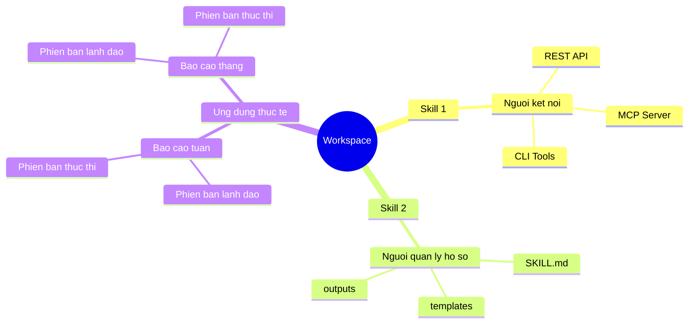
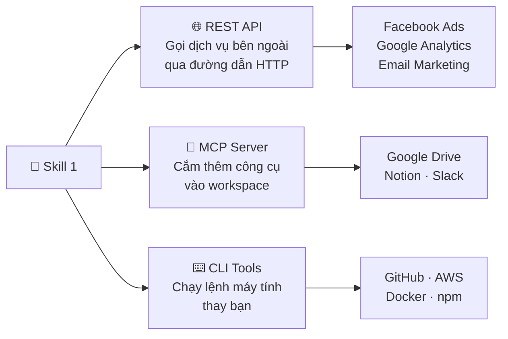
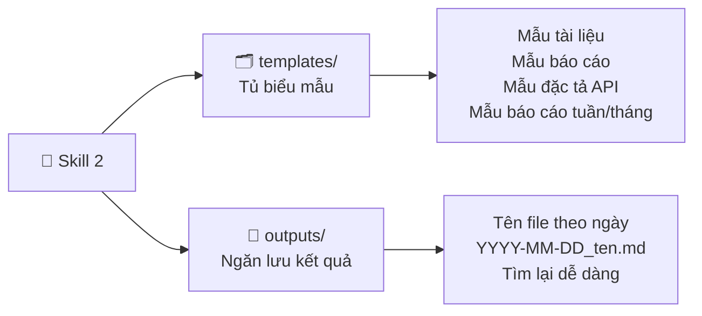
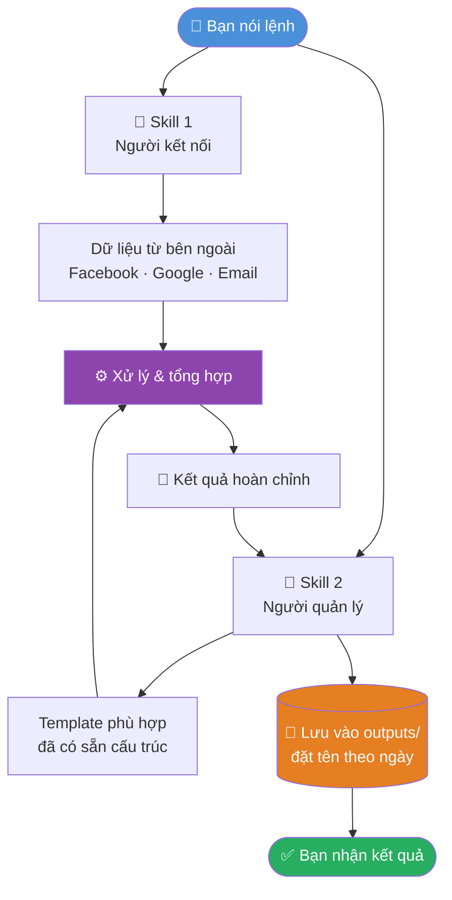
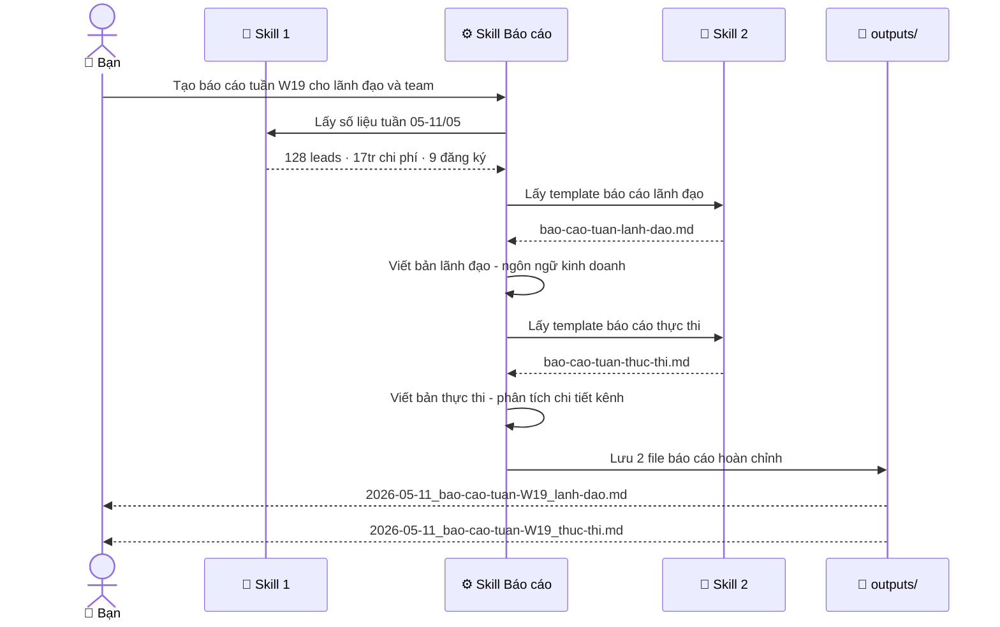

# 🧠 Personal Workspace với Skills

> Workspace cá nhân chạy trên **Claude Code** · 2 skills cốt lõi · Tự động hoá công việc lặp lại · Không cần biết lập trình

**Dành cho:** [Non-tech](#-2-skills--nhin-nhanh) · [Tech](#-cau-truc-file) · [Xem demo](#-vi-du-thuc-te-bao-cao-tuan) · [Dùng ngay](#-dung-ngay)

---

## 🗺️ Toàn cảnh



---

## ⚡ 2 Skills — Nhìn nhanh

| | 🔗 Skill 1 | 📁 Skill 2 |
|--|-----------|-----------|
| **Tên** | Người kết nối | Người quản lý hồ sơ |
| **Làm gì** | Đi ra ngoài lấy thứ bạn cần | Giữ mọi thứ ngăn nắp trong nhà |
| **Gọi bằng** | `/ket-noi-nen-tang-ngoai` | `/quan-ly-files` |
| **Khả năng** | REST API · MCP · CLI | Templates · Outputs |
| **File định nghĩa** | `.claude/skills/ket-noi-nen-tang-ngoai.md` | `.claude/skills/quan-ly-files.md` |

---

## 🔗 Skill 1 — Người kết nối



| Bạn nói | Skill làm |
|---------|----------|
| _"Lấy số liệu Facebook Ads tuần này"_ | Tự kết nối API · kéo leads, CPL, chi phí về |
| _"Tạo repo GitHub mới tên ABC"_ | Tự chạy `gh repo create ABC` |
| _"Đọc file trong Google Drive của tôi"_ | Dùng MCP Drive · đọc và trả nội dung về |

---

## 📁 Skill 2 — Người quản lý hồ sơ



| Bạn nói | Skill làm |
|---------|----------|
| _"Tạo báo cáo tháng cho lãnh đạo"_ | Lấy đúng mẫu · điền số · xuất file |
| _"Tìm báo cáo tuần W19 tháng 5"_ | Tìm trong `outputs/` · trả file đúng |
| _"Tạo template mới cho brief video"_ | Tạo file mẫu · lưu vào `templates/` |

---

## 🔄 Workflow — 2 Skills phối hợp



---

## 📊 Ví dụ thực tế: Báo cáo tuần

> **Tình huống:** Tạo báo cáo tuần W19 (05–11/05/2026) với 2 phiên bản cho lãnh đạo và nhóm thực thi



### ⏱️ Trước & Sau

| Công việc | ⏰ Trước | ⚡ Sau |
|-----------|---------|-------|
| Kéo số từ 4 tool | 45 phút | Tự động |
| Viết báo cáo lãnh đạo | 60 phút | 0 phút |
| Viết báo cáo thực thi | 60 phút | 0 phút |
| Lưu đúng chỗ · đúng tên | 5 phút | Tự động |
| **Tổng mỗi thứ 2** | **~2.5 giờ** | **~5 phút** |

📂 **Xem output thực tế:**
[DEMO — Giải thích quá trình chạy](skills/quan-ly-files/outputs/DEMO_bao-cao-skill-chay-thu.md) ·
[Báo cáo W19 — Lãnh đạo](skills/quan-ly-files/outputs/2026-05-11_bao-cao-tuan-W19_lanh-dao.md) ·
[Báo cáo W19 — Thực thi](skills/quan-ly-files/outputs/2026-05-11_bao-cao-tuan-W19_thuc-thi.md)

---

## 💡 Token & Lợi ích

### 🔋 Tiết kiệm token

> **Token** = nhiên liệu để Claude chạy. Skills lưu sẵn hướng dẫn → không cần giải thích lại → không tốn token lặp

| | Không có skills | Có skills | Tiết kiệm |
|--|----------------|-----------|----------|
| Giải thích format & quy tắc | ~800 token | ~0 token | ~800 token |
| Sinh output sai · phải làm lại | ~1.200 token | ~0 token | ~1.200 token |
| Sinh output đúng ngay lần đầu | — | ~800 token | — |
| **Tổng / lần** | **~3.000 token** | **~800 token** | **~73%** |

> 📅 **4 báo cáo/tháng:** ~12.000 token → ~3.200 token · **Tiết kiệm ~8.800 token/tháng**

### 🎯 Lợi ích khác

| | Lợi ích | Kết quả |
|-|---------|--------|
| 🎯 | **Nhất quán** | Cùng 1 format mọi lần · không lệch chuẩn |
| 📈 | **Tích luỹ** | Mỗi lần chạy để lại 1 file · kho lịch sử tự xây |
| 🧩 | **Mở rộng** | Thêm skill mới chồng lên · không xây lại từ đầu |
| 👥 | **Chia sẻ** | Team clone repo là dùng được · không cần giải thích |

---

## 🚀 Dùng ngay

**Cú pháp:** `/[tên-skill]` + mô tả việc muốn làm

```bash
# Lấy dữ liệu từ nền tảng ngoài
/ket-noi-nen-tang-ngoai  Lấy số liệu Facebook Ads tuần này

# Tạo tài liệu từ template
/quan-ly-files  Tạo báo cáo tháng 5 cho lãnh đạo

# Tìm lại file cũ
/quan-ly-files  Tìm báo cáo tuần W19 tháng 5

# Dùng cả 2 skills — chỉ cần mô tả việc muốn làm
Tạo báo cáo tuần W20 cho cả lãnh đạo và team.
Số liệu: Facebook 92 leads 11tr, Google 18 leads 5tr, Email open rate 28%
```

---

## 📂 Cấu trúc file

```
personal-workspace/
│
├── 📋 README.md
│
├── 🧠 .claude/skills/                        ← Não của từng skill
│   ├── ket-noi-nen-tang-ngoai.md             ← Skill 1: sổ tay hướng dẫn
│   ├── quan-ly-files.md                      ← Skill 2: sổ tay hướng dẫn
│   └── bao-cao.md                            ← Skill ứng dụng (báo cáo)
│
└── 💪 skills/                                ← Tay chân của từng skill
    ├── 🔗 ket-noi-nen-tang-ngoai/
    │   ├── api/        config · request-template
    │   ├── mcp/        config
    │   └── cli/        common-commands
    │
    └── 📁 quan-ly-files/
        ├── templates/  document · report · api-spec
        │   └── reports/  bao-cao-tuan/thang × lanh-dao/thuc-thi
        └── outputs/    ← Kết quả từ các lần chạy skill
```

---

<div align="center">

**🔗 Skill 1 đi ra ngoài lấy thứ bạn cần**  
**📁 Skill 2 giữ cho mọi thứ ngăn nắp trong nhà**  
**Bạn chỉ cần nói — không cần tự làm bước nào**

</div>
