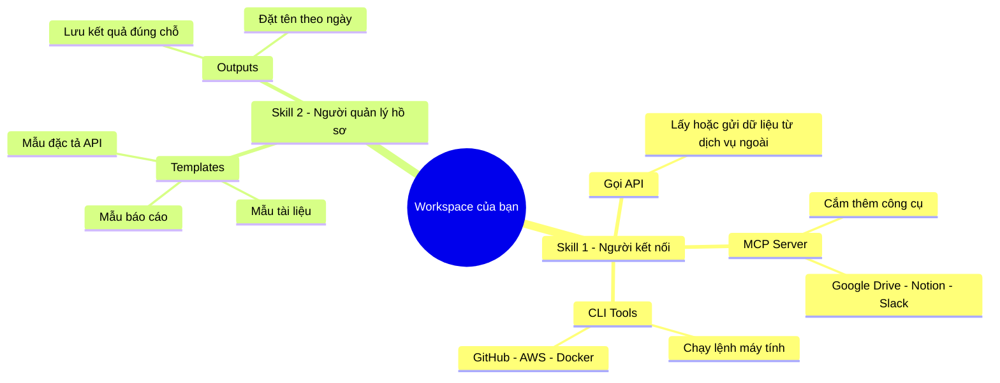
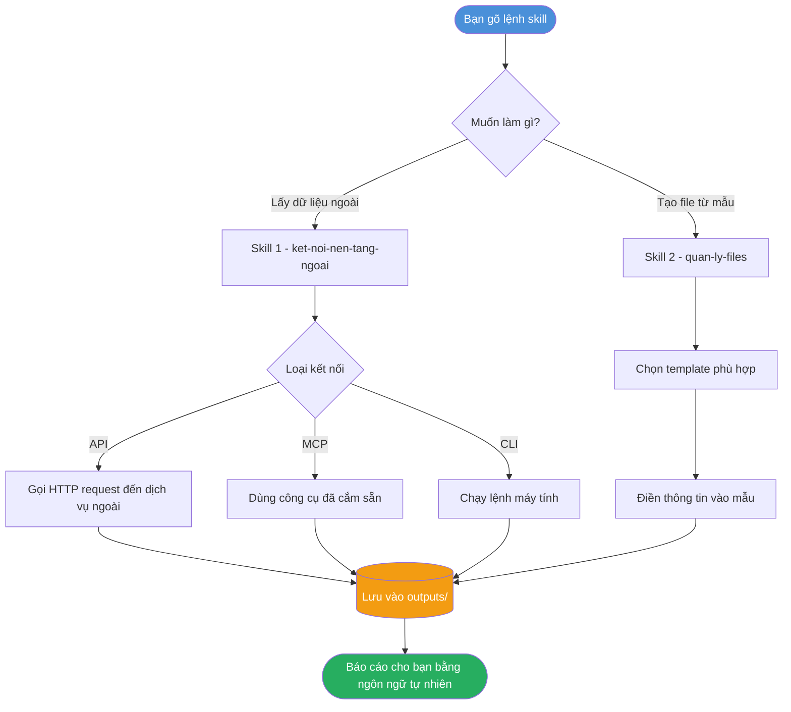
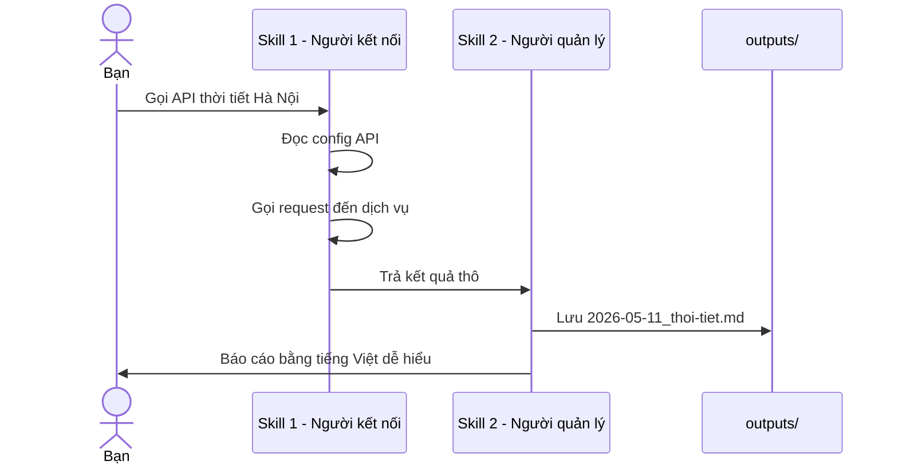

# Không gian làm việc cá nhân với các Skills

> Workspace chạy trên Claude Code với 2 skills — viết cho người chưa biết lập trình.

---

## Toàn cảnh workspace



---

## 2 Trợ lý trong workspace

### Trợ lý 1 — Người kết nối
*Đi ra ngoài lấy thứ bạn cần*

| Khả năng | Bạn nói gì | Trợ lý làm gì |
|----------|-----------|--------------|
| Gọi API | "Lấy dữ liệu thời tiết Hà Nội" | Kết nối dịch vụ thời tiết, trả kết quả về |
| MCP Server | "Đọc file trong Google Drive của tôi" | Cắm kết nối Drive, đọc file thay bạn |
| CLI Tools | "Tạo repo GitHub mới tên ABC" | Chạy lệnh `gh repo create ABC` thay bạn |

### Trợ lý 2 — Người quản lý hồ sơ
*Giữ cho mọi thứ ngăn nắp trong nhà*

| Khả năng | Bạn nói gì | Trợ lý làm gì |
|----------|-----------|--------------|
| Templates | "Tạo báo cáo tuần cho tôi" | Lấy mẫu sẵn có, điền thông tin, xuất file |
| Lưu Outputs | *(tự động)* | Đặt tên file theo ngày, lưu đúng ngăn |

---

## Workflow khi dùng



---

## Ví dụ thực tế từng bước



---

## Cấu trúc thư mục

```
personal-workspace/
│
├── .claude/skills/
│   ├── ket-noi-nen-tang-ngoai.md   ← Sổ tay hướng dẫn Skill 1
│   └── quan-ly-files.md            ← Sổ tay hướng dẫn Skill 2
│
└── skills/
    ├── ket-noi-nen-tang-ngoai/
    │   ├── api/         ← Cấu hình & mẫu gọi API
    │   ├── mcp/         ← Danh sách MCP server
    │   └── cli/         ← Bộ lệnh CLI phổ biến
    └── quan-ly-files/
        ├── templates/   ← Biểu mẫu tái sử dụng
        └── outputs/     ← Kết quả từ các lần chạy
```

---

> **Tóm lại:** Skill 1 đi ra ngoài lấy thứ bạn cần — Skill 2 giữ cho mọi thứ ngăn nắp trong nhà.  
> Bạn chỉ cần nói, không cần tự làm gì.
