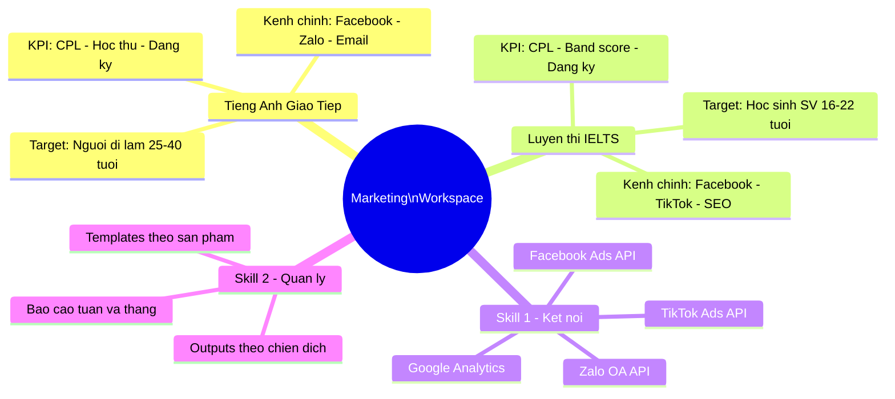
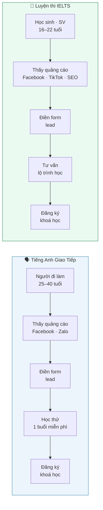
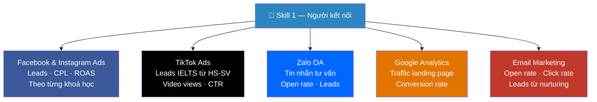
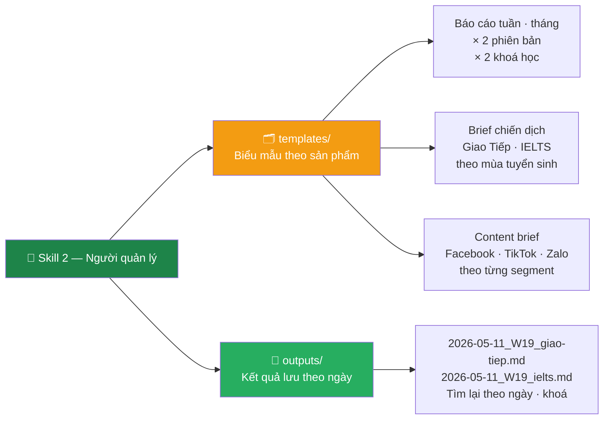
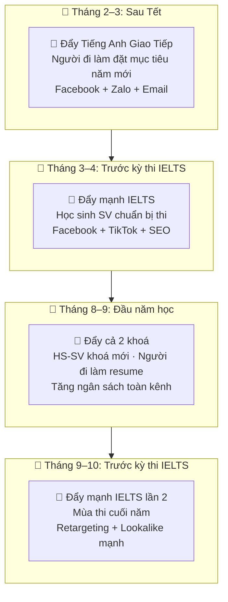
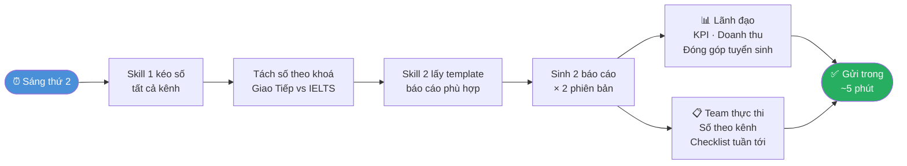
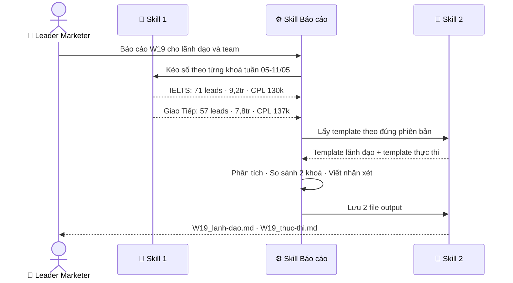

# 🎓 Marketing Workspace — Trung tâm Anh ngữ

> Workspace của **Leader Marketer** · Trung tâm Anh ngữ · Chạy trên Claude Code  
> Tối ưu cho 2 sản phẩm: **Tiếng Anh Giao Tiếp** (người đi làm) & **Luyện thi IELTS** (học sinh · sinh viên)

---

## 🗺️ Toàn cảnh



---

## 📦 2 Sản phẩm · 2 Hành trình học viên



---

## ⚡ 2 Skills cốt lõi

| | 🔗 Skill 1 | 📁 Skill 2 |
|--|-----------|-----------|
| **Vai trò** | Người kết nối | Người quản lý hồ sơ |
| **Làm gì** | Kéo số từ tất cả kênh về 1 chỗ | Giữ template & lưu output đúng chỗ |
| **Gọi bằng** | `/ket-noi-nen-tang-ngoai` | `/quan-ly-files` |
| **Phục vụ** | Báo cáo · Phân tích · Tự động hoá | Tài liệu · Brief · Kết quả chiến dịch |

---

## 🔗 Skill 1 — Kết nối nền tảng



**Ví dụ dùng Skill 1:**

| Bạn nói | Skill làm |
|---------|----------|
| _"Lấy số leads 2 khoá tuần này"_ | Kéo Facebook + TikTok + Zalo → phân tách IELTS vs Giao Tiếp |
| _"So sánh CPL tháng này vs tháng trước"_ | Kéo dữ liệu 2 kỳ · tính chênh lệch · highlight bất thường |
| _"Khoá nào đang lấp đầy lớp nhanh hơn?"_ | Kéo số đăng ký vs chỉ tiêu lớp từng khoá |

---

## 📁 Skill 2 — Quản lý hồ sơ



---

## 📅 Workflow theo mùa tuyển sinh



---

## 🔄 Workflow hàng tuần — Thứ 2



---

## 📊 Ví dụ thực tế: Báo cáo tuần W19

> **Số liệu:** Facebook 85 leads (IELTS 49 · Giao Tiếp 36) · Google 23 leads · SEO 12 · Email 8 · Tổng 128 leads · 17tr chi phí



**KPI theo từng khoá:**

| KPI | 🗣️ Giao Tiếp | 📝 IELTS | Ghi chú |
|-----|------------|--------|---------|
| Leads tuần | 57 | 71 | IELTS cao hơn do gần mùa thi |
| CPL | 137.000đ | 130.000đ | Cả 2 dưới ngưỡng 150k ✅ |
| Tỷ lệ học thử → đăng ký | 9,1% | 6,8% | Giao Tiếp convert tốt hơn |
| Lớp lấp đầy | 78% | 65% | IELTS cần đẩy thêm |

---

## ⏱️ Trước & Sau khi có Skills

| Công việc | ⏰ Trước | ⚡ Sau |
|-----------|---------|-------|
| Tách leads theo từng khoá | 30 phút | Tự động |
| Báo cáo lãnh đạo (2 khoá) | 75 phút | 0 phút |
| Báo cáo team thực thi (2 khoá) | 75 phút | 0 phút |
| Brief chiến dịch mùa thi IELTS | 45 phút | 10 phút |
| **Tổng/tuần** | **~4 giờ** | **~15 phút** |

---

## 💡 Token & Lợi ích

| | Không có Skills | Có Skills | Tiết kiệm |
|--|----------------|-----------|----------|
| Giải thích context 2 khoá · 2 phiên bản | ~1.000 token | ~0 token | ~1.000 token |
| Sinh báo cáo sai format · làm lại | ~1.200 token | ~0 token | ~1.200 token |
| Sinh đúng ngay lần đầu | — | ~800 token | — |
| **Tổng / lần báo cáo** | **~3.200 token** | **~800 token** | **~75%** |

> 📅 **8 báo cáo/tháng** (tuần × 2 phiên bản): ~25.600 token → ~6.400 token · **Tiết kiệm ~19.200 token/tháng**

---

## 🚀 Dùng ngay

```bash
# Báo cáo tuần cho lãnh đạo — cả 2 khoá
/bao-cao  Báo cáo tuần W20 cho lãnh đạo.
          IELTS: 78 leads 10tr. Giao Tiếp: 61 leads 8,5tr.

# Báo cáo tuần cho team thực thi
/bao-cao  Báo cáo tuần W20 cho team.
          IELTS: FB 52 leads CPL 128k, TikTok 18 leads CPL 145k.
          Giao Tiếp: FB 38 leads CPL 134k, Zalo 15 leads CPL 112k, Email 8 leads.

# Brief chiến dịch mùa thi IELTS tháng 9
/quan-ly-files  Tạo brief chiến dịch IELTS tháng 9.
                Target: HS-SV chuẩn bị thi tháng 10-11.
                Ngân sách: 45tr. Kênh: Facebook + TikTok + SEO.

# Kéo số so sánh 2 khoá
/ket-noi-nen-tang-ngoai  So sánh CPL và leads của IELTS vs Giao Tiếp
                          từ đầu tháng 5 đến nay theo từng kênh.
```

---

## 📂 Cấu trúc file

```
personal-workspace/
│
├── 📋 README.md
│
├── 🧠 .claude/skills/
│   ├── ket-noi-nen-tang-ngoai.md    ← Kết nối FB · TikTok · Zalo · GG · Email
│   ├── quan-ly-files.md             ← Quản lý template & output theo khoá
│   └── bao-cao.md                   ← Báo cáo × 2 khoá × 2 phiên bản
│
└── 💪 skills/
    ├── 🔗 ket-noi-nen-tang-ngoai/
    │   ├── api/         config theo từng nền tảng
    │   ├── mcp/         Google Drive · Sheets
    │   └── cli/         gh · gcloud · aws
    │
    └── 📁 quan-ly-files/
        ├── templates/
        │   └── reports/
        │       ├── bao-cao-tuan-lanh-dao.md     ← KPI kinh doanh · 2 khoá
        │       ├── bao-cao-tuan-thuc-thi.md     ← Phân tích kênh · checklist
        │       ├── bao-cao-thang-lanh-dao.md    ← Chiến lược · mùa tuyển sinh
        │       └── bao-cao-thang-thuc-thi.md    ← Stop · Continue · Start
        └── outputs/
            ├── 2026-05-11_bao-cao-tuan-W19_lanh-dao.md
            ├── 2026-05-11_bao-cao-tuan-W19_thuc-thi.md
            └── DEMO_bao-cao-skill-chay-thu.md
```

---

<div align="center">

**🗣️ Tiếng Anh Giao Tiếp · 📝 Luyện thi IELTS**

*Skill 1 kéo số từ mọi kênh về · Skill 2 lưu đúng chỗ · Bạn chỉ cần ra quyết định*

</div>
