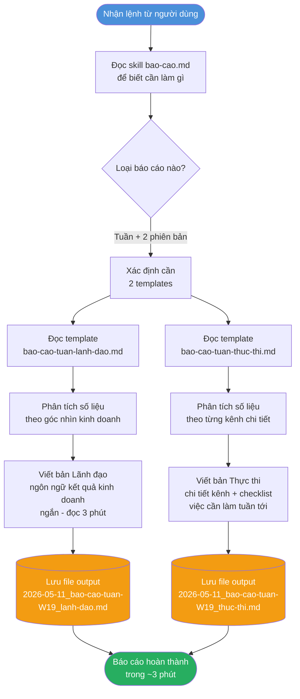
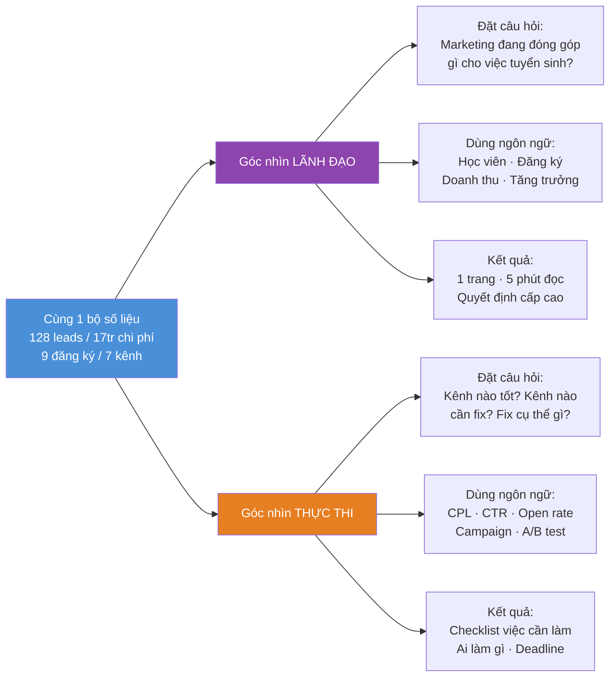

# Demo chạy thử — Skill Báo cáo

> File này ghi lại toàn bộ quá trình skill `/bao-cao` chạy tạo báo cáo tuần W19  
> Dành cho người muốn hiểu skill hoạt động như thế nào từng bước

---

## Skill nhận lệnh gì?

```
Người dùng nói:
"Tạo báo cáo tuần W19 (05–11/05/2026) với số liệu sau:
- Facebook Ads: 85 leads, CPL 125k, chi phí 10.625.000đ
- Google Ads: 23 leads, CPL 280k, chi phí 6.440.000đ  
- SEO: 12 leads organic
- Email: 8 leads, open rate 31,4%
- Mục tiêu tháng: 600 leads, ≤150k CPL, 45 đăng ký
Tạo cả 2 phiên bản: lãnh đạo và thực thi."
```

---

## Skill đã làm gì từng bước



---

## Skill đã "nghĩ" khác nhau như thế nào cho 2 phiên bản?



---

## Kết quả của lần chạy thử này

| | Chi tiết |
|-|---------|
| **Thời gian thực hiện** | ~3 phút |
| **Số files tạo ra** | 2 files báo cáo + 1 file demo này |
| **Phiên bản lãnh đạo** | `2026-05-11_bao-cao-tuan-W19_lanh-dao.md` |
| **Phiên bản thực thi** | `2026-05-11_bao-cao-tuan-W19_thuc-thi.md` |
| **Trạng thái** | Chạy thành công |

---

## Nếu không có skill — quy trình cũ trông như thế nào?

```
Mở Facebook Ads Manager → kéo số → copy sang Excel
     ↓
Mở Google Analytics → kéo số → copy sang Excel  
     ↓
Mở email tool → kéo số → copy sang Excel
     ↓
Ngồi phân tích, viết nhận xét
     ↓
Viết bản lãnh đạo (1 file)
     ↓
Viết lại bản thực thi (1 file khác)
     ↓
Format cho đẹp, gửi đi

Tổng: 2–3 giờ mỗi thứ 2
```

```
Với skill — quy trình mới:

Cung cấp số liệu → Gõ lệnh → Nhận 2 báo cáo hoàn chỉnh

Tổng: ~5 phút nhập số + 3 phút skill chạy = 8 phút
```

---

## Các bước tiếp theo để dùng thật

1. **Kết nối API** (qua Skill 1) để không cần nhập số tay
2. **Chạy mỗi sáng thứ 2** — skill tự kéo số từ tuần trước, tạo báo cáo
3. **Gửi thẳng** bản lãnh đạo cho sếp, bản thực thi cho team

> File này được tạo tự động bởi skill `/bao-cao` | 11/05/2026
